<div align="center" id="top"> 
  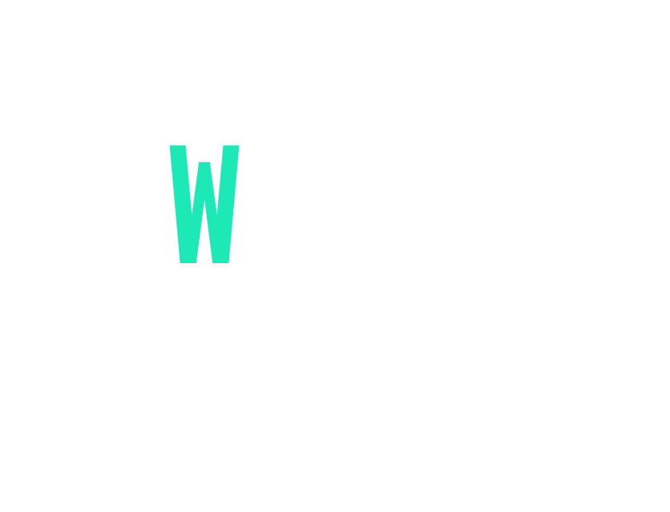
</div>

<h1 align="center">Which Phone</h1>

<p align="center">
  
  
  
  
  
  
  
</p>

<p align="center">
  <a href="#dart-about">About</a> &#xa0; | &#xa0; 
  <a href="#sparkles-features">Features</a> &#xa0; | &#xa0;
  <a href="#rocket-technologies">Technologies</a> &#xa0; | &#xa0;
  <a href="#white_check_mark-requirements">Requirements</a> &#xa0; | &#xa0;
  <a href="#checkered_flag-starting">Starting</a> &#xa0; | &#xa0;
  <a href="#memo-license">License</a> &#xa0; | &#xa0;
  <a href="https://github.com/NDRBAX" target="_blank">Author</a>
</p>

<br>

## :dart: About

</br>

Which Phone aims to help users make more responsible consumption choices by finding smartphones that fits their budget and needs. By doing so, it can help extend the life of a smartphone. Additionnaly, Wich Phone aims to help users discover news smartphones beyond just the major brands (Apple, Samsung, Huawei...) and to avoid having to read through technical tests that may not be understood by everyone.

This project was developed using Django for the backend and Vue.js for the frontend. It has seven pages:

- Home page which provides information about the site and its purpose,
- Search page where the user can answer six questions to help us understand their needs and provide relevant results,
- Categories page based on user type (gamer, business, student, traveler, child, senior),
- Favorites page (Wishlist),
- Register page,
- Login page,
- Settings page.

Search page is the heart of Which Phone. When the user submits their answers to the six questions (daily usage time, type of usage, storage needs, screen size preferences, main desired features, and available budget), they are processed by the server which searches the database and selects the appropriate devices. The server then sends the response back to the frontend. The user has the option to filter the results based on price and other technical specifications. If the user is connected, they have the ability to add devices to their favorites or, in one click, be directed to online sales platforms that may offer the device for sale.

</br>

## :fireworks: Front-end organisation

</br>

```
├── dataENG.js                    # all-data are stored here
├── index.html
├── package.json
├── package-lock.json
├── postcss.config.js
├── public
│   └── favicon.svg
├── src
│   ├── App.vue
│   ├── assets
│   ├── components
│   │   ├── AnimatedNumber.vue
│   │   ├── CategoryFilters.vue
│   │   ├── CustomLoader.vue
│   │   ├── FooterOne.vue
│   │   ├── MessageError.vue
│   │   ├── MultiStepForm.vue
│   │   ├── NavBar.vue
│   │   ├── PhoneCard.vue
│   │   └── __tests__
│   ├── main.js
│   ├── router
│   │   └── index.js
│   ├── stores
│   │   ├── auth.js
│   │   ├── checked.js
│   │   └── csrftoken.js
│   └── views
│       ├── CategoriesView.vue
│       ├── HomeView.vue
│       ├── LoginView.vue
│       ├── ProfileView.vue
│       ├── RegisterView.vue
│       ├── SearchView.vue
│       └── WishListView.vue
├── tailwind.config.js
└── vite.config.js
```

## :thinking: Back-end organisation

</br>

```
├── backend
│   ├── backend
│   │   ├── asgi.py
│   │   ├── __init__.py
│   │   ├── __pycache__
│   │   ├── settings.py
│   │   ├── urls.py
│   │   └── wsgi.py
│   ├── db.sqlite3
│   ├── manage.py
│   └── wphone
│       ├── admin.py
│       ├── apps.py
│       ├── data.py
│       ├── __init__.py
│       ├── models.py
│       ├── __pycache__
│       ├── serializers.py
│       ├── tests.py
│       ├── urls.py
│       ├── utils.py
│       └── views.py
├── package-lock.json
├── requirements.in
└── requirements.txt
```

</br>

## :sparkles: Features

</br>

:heavy_check_mark: Responsive design, and animations,\
:heavy_check_mark: Secure register and login via JWT\
:heavy_check_mark: Option to recover password\
:heavy_check_mark: Search function fast and personnalized\
:heavy_check_mark: Redirect to online sales platforms

</br>

## :desktop_computer: Large screens

</br>

<div align="center">
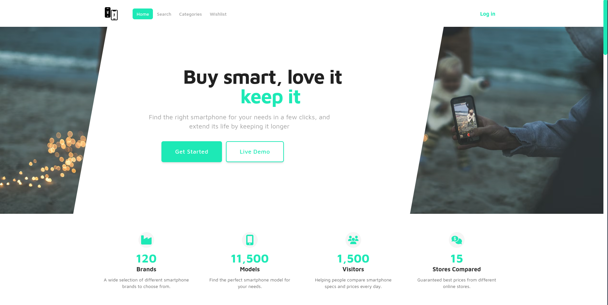
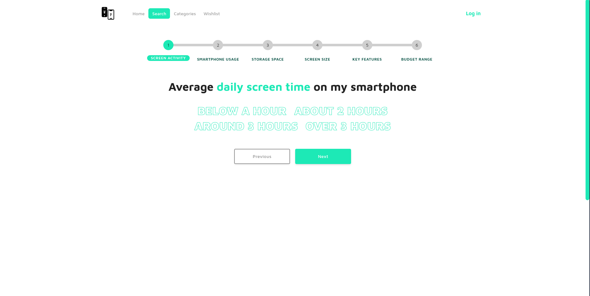
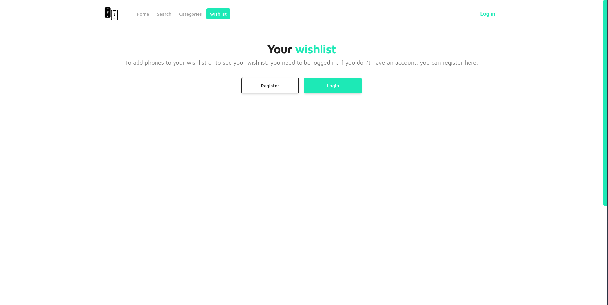
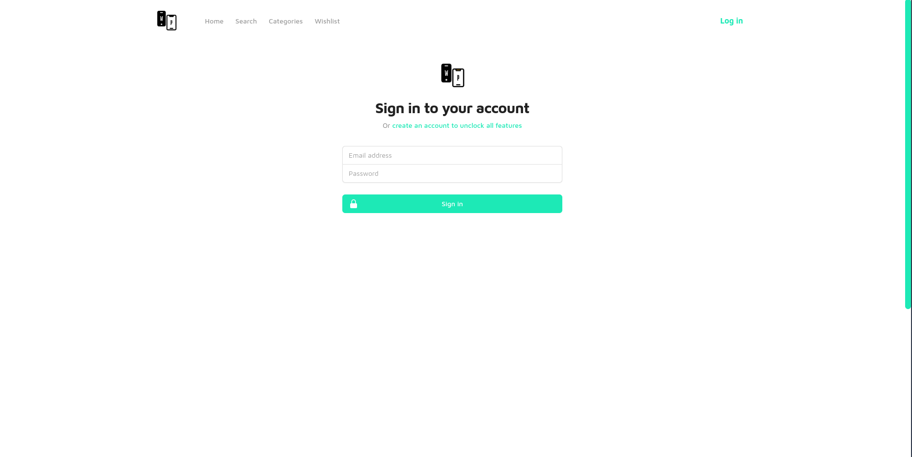
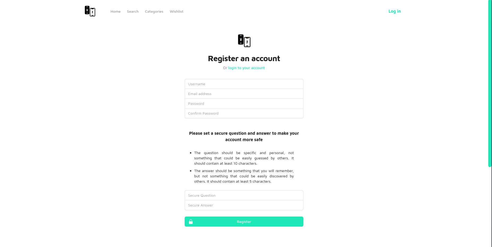
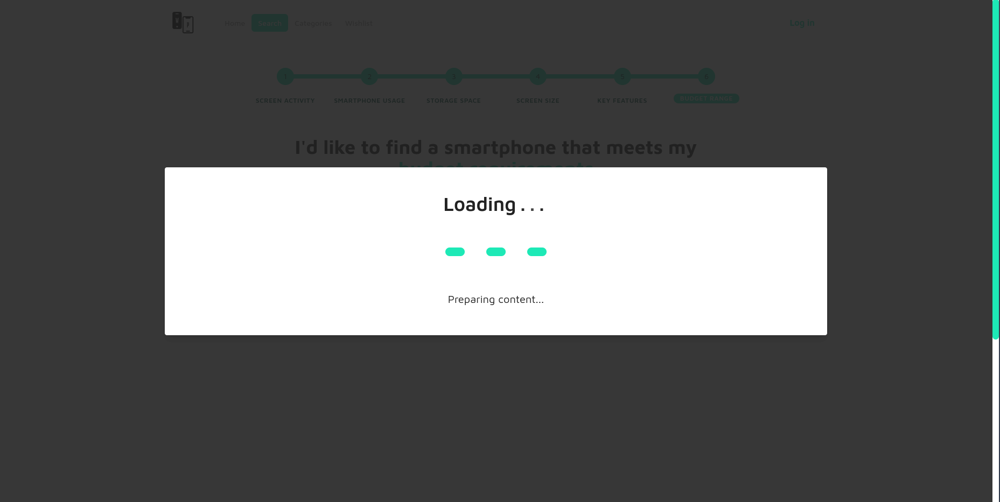
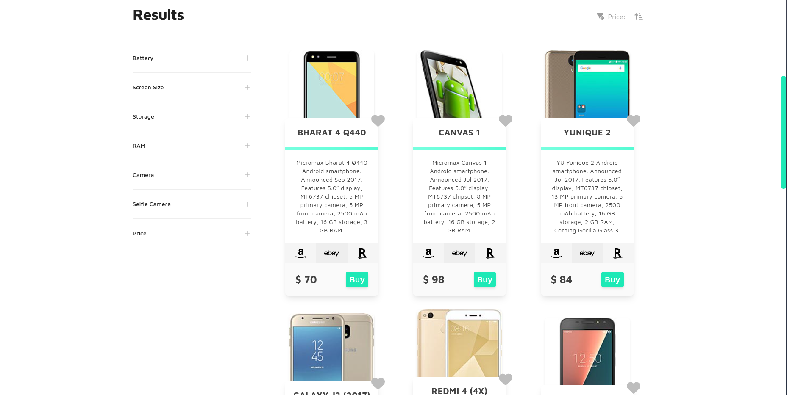
</div>

## :iphone: Smartphone

</br>

<div align="center">
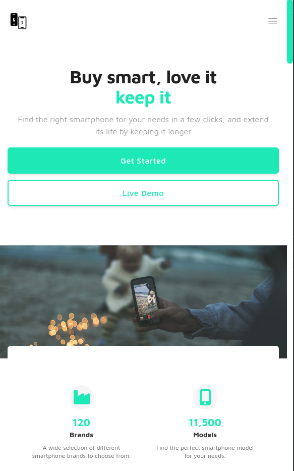
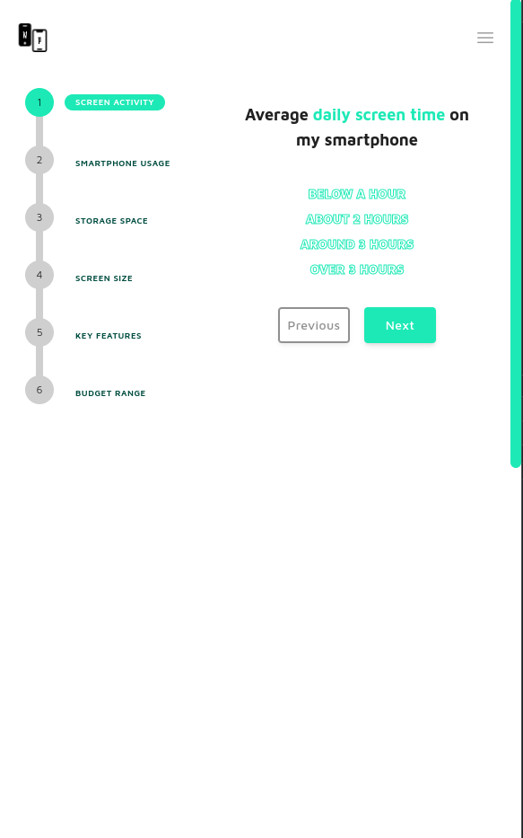
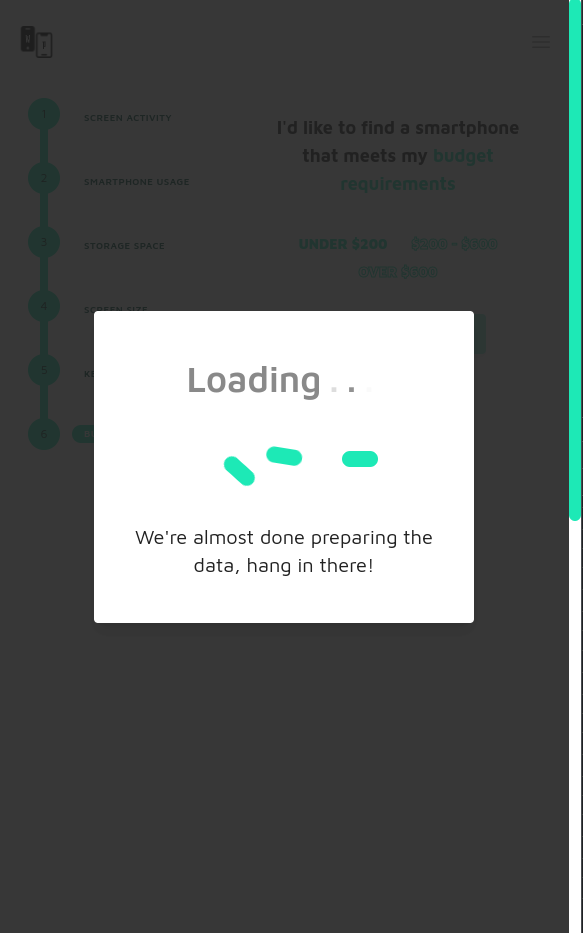
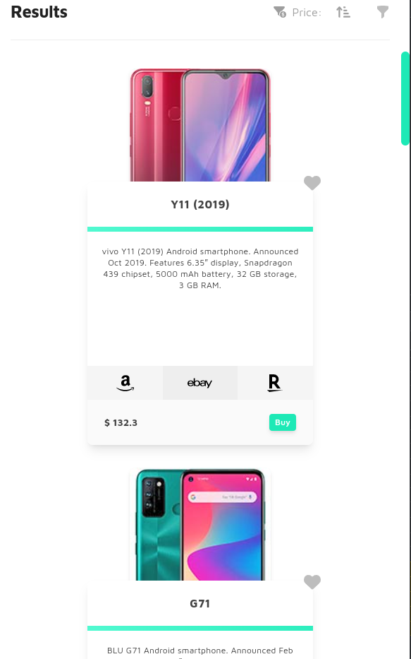
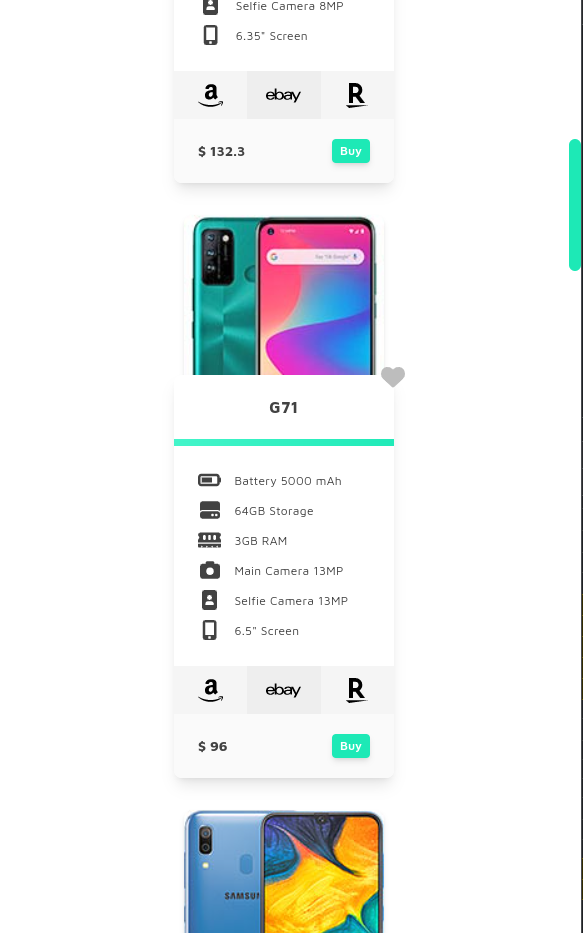
</div>

</br>

## :rocket: Technologies

</br>

The following tools were used in this project:

### :stars: Backend

- [Django](https://www.djangoproject.com/)
- [Django Rest Framework](https://www.django-rest-framework.org/)
- [Djoser](https://djoser.readthedocs.io/en/latest/)
- [PyJWT](https://pyjwt.readthedocs.io/en/latest/)
- [jwt](https://pypi.org/project/jwt/)
- [Pip-tools](https://pip-tools.readthedocs.io/en/latest/)

### :star2: Frontend

- [Vue JS](https://vuejs.org/)
- [Axios](https://axios-http.com/)
- [Pinia](https://pinia.vuejs.org/)
- [Vue router](https://router.vuejs.org/)
- [Vue 3 cookies](https://www.npmjs.com/package/vue3-cookies)
- [Gsap](https://greensock.com/gsap/)
- [Tailwind CSS](https://tailwindcss.com/)
- [Daisy UI](https://daisyui.com/)
- [Headless UI](https://headlessui.com/)
- [Heroicons](https://heroicons.com/)
- [Font Awesome Icons](https://fontawesome.com/)
- [Vue 3 Simple Icons](https://www.npmjs.com/package/vue3-simple-icons)

</br>

## :white_check_mark: Requirements

</br>

Before starting :checkered_flag:, you need to have [Git](https://git-scm.com), [npm](https://www.npmjs.com/), [Node.js](https://nodejs.org/en/download/) and [Python](https://docs.python.org/3/whatsnew/3.11.html) installed.

</br>

## :checkered_flag: Starting

</br>

```bash
# Clone this project
$ git clone https://github.com/NDRBAX/which-phone

# Access
$ cd which-phone

# Make and apply migrations
$ cd wp-backend && python manage.py makemigrations && python manage.py migrate

# Install dependencies with pip or pip-tools (If you want to give a try in virtual environment, you should activate venv first)
$ pip-sync                                            # with pip-tools
$ pip install -r requirements.txt           # with pip

# Create superuser
$ python manage.py createsuperuser
$ python manage.py runserver

# Run the project
$ cd which-phone/wp-frontend

# Install npm modules
$ npm install
```

</br>

<center>

This project is under license from MIT. For more details, see the [LICENSE](LICENSE.md) file.

Made with :heart: by <a href="https://github.com/NDRBAX" target="_blank">NDRBAX</a>

<a href="#top">Back to top</a>

</center>
